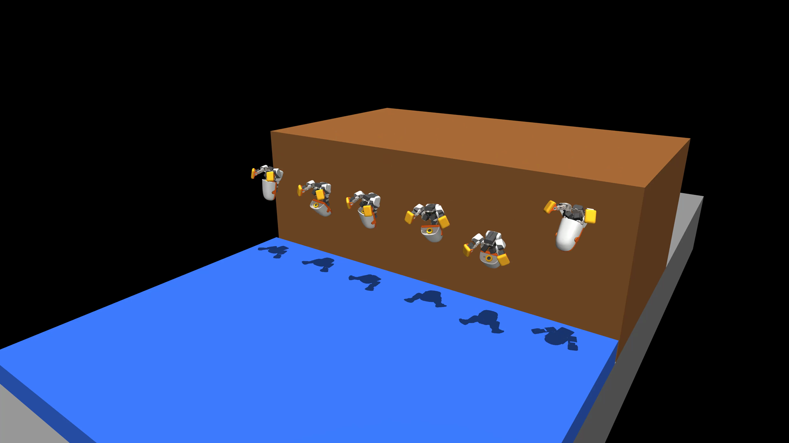

# Microduck box backflip

Task id: `Mjlab-BoxFlip-Flat-MicroDuck`. The duck starts standing on the edge of a
0.8 m box, throws itself backward off the edge, completes a full turn in the air
(~380 ms of flight) and lands on its feet on a crash mat, then stands up.



Videos in this folder (checkpoint v4 6500–6750):

| file | what |
|---|---|
| `six_ducks_one_sim_4k_slowmo.mp4` | six ducks on one ledge, one camera, 4K, quarter speed with motion interpolation |
| `six_ducks_one_sim_front_realtime.mp4` | same shot head-on, real speed |
| `three_views_slowmo.mp4` | one duck from side / three-quarter / behind, one-third speed |
| `backflip_v4_slowmo.mp4`, `backflip_v4_realtime.mp4` | single duck, side view |
| `backflip_v1_frames.png` | frame sheet of the v1 (head-tripod) landing, for contrast |

Six ducks in one scene: `scripts/backflip/render_row.py` lays the terrain out as
N narrow tiles so the boxes fuse into one ledge, gives each env its own slot,
and renders every neighbour into one frame (`ViewerConfig.max_extra_envs`).
The envs are still separate physics worlds, so they cannot collide.

A backflip from flat ground is out of reach for this robot: a standing jump gives
~60 ms of airtime. Tipping off a box edge supplies the spin (13–15 rad/s from
gravity) and the drop supplies the airtime, which is why the task lives on a box.

## Rules the reward encodes

1. Spawn standing at the home pose on the box edge, no push, no mid-air spawn.
2. Rotation counts only while the trunk is level side to side (no shoulder rolls).
3. Landing rewards open only after 300° of rotation and are a *product* of:
   feet on the mat × trunk upright × all 14 servos near the standing pose ×
   head off the ground × head directly above the feet × clean-landing factor.
4. Clean-landing factor = exp(−dirty_steps): any head contact, or any non-foot
   contact on the mat, counts as a dirty step. Only a perfectly clean landing pays
   in full, but fewer dirty steps always pay more (a binary latch froze training).
5. One-time bonus at first mat contact for how much of the turn was finished in
   the air (Gaussian on 360° − rotation, σ = 40°).
6. Penalties: head on terrain (−4), non-foot body on terrain (−1), rotation past
   one turn + 25° (quadratic), out-of-plane spin, action rate.

Code: `src/mjlab_microduck/tasks/boxflip_mdp.py` (terms),
`microduck_boxflip_env_cfg.py` (weights), `boxflip_terrain.py` (box + mat).

## Training history

| run | change | result |
|---|---|---|
| v1 | feet × upright landing | 360° every time, but landed in a **head tripod** (head on mat, legs folded, trunk upright) — the reward could not tell |
| v2 | + pose Gaussian, head-free factor, head penalty | stands up, but lands head-first for ~40 ms at ~290° then rocks onto the feet |
| v3 | + binary clean-landing latch | froze: landing reward exactly 0 for 400 iterations, no gradient |
| v4 | soft clean factor + touchdown bonus, fine-tuned from v2 | feet-first at ~350°, stands with head over feet; one 20 ms head graze in the landing crouch remains |

Lesson (already in AGENTS.md, learned again): every hard gate needs a slope next
to it, and trunk-only telemetry cannot see a head-tripod. Audit checkpoints with
whole-episode contact counts, not end-state numbers.

## Reproduce

```bash
uv run train Mjlab-BoxFlip-Flat-MicroDuck --env.scene.num-envs 4096      # ~8 h on an A100
uv run python scripts/backflip/audit_flip.py Mjlab-BoxFlip-Flat-MicroDuck <ckpt.pt> 32
uv run python scripts/backflip/trace_contacts.py Mjlab-BoxFlip-Flat-MicroDuck <ckpt.pt>
uv run python scripts/backflip/render_checkpoint.py Mjlab-BoxFlip-Flat-MicroDuck <ckpt.pt> out.mp4 125
uv run python scripts/backflip/render_row.py Mjlab-BoxFlip-Flat-MicroDuck <ckpt.pt> row.mp4 120 6 35 -20 2.6 "-0.7,0,0.5" 3840 2160   # 6 ducks, one scene
.venv/bin/python scripts/backflip/play_viser.py Mjlab-BoxFlip-Flat-MicroDuck --checkpoint-file <ckpt.pt> --viewer viser
```

`model_v4_6500.pt` is the checkpoint in the videos.
